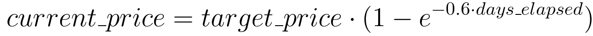
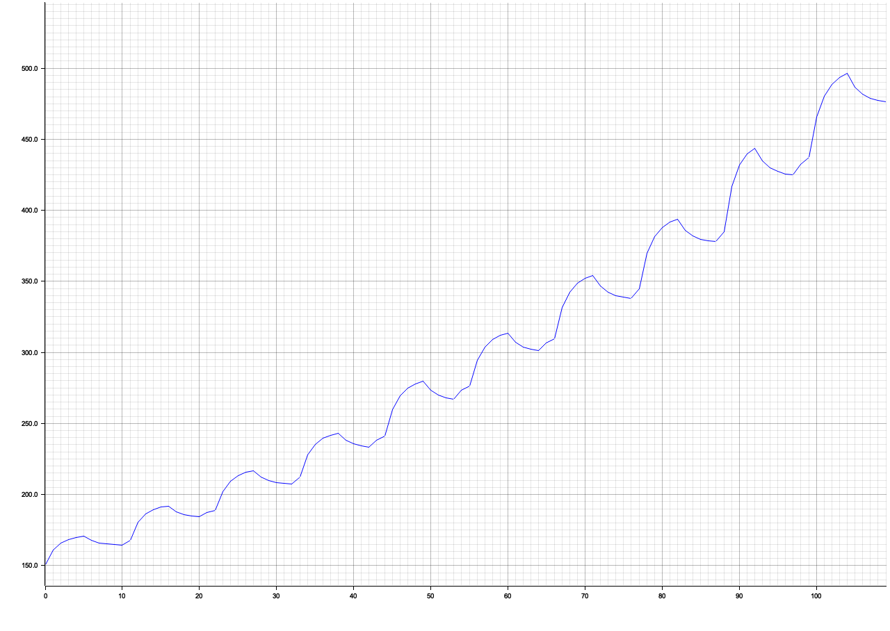

# TASE Market documentation reference

### Global price monitoring
Whenever we receive a buy/sell event (meaning that the trader bought/sold to/from other markets) we save the price at which the trader bought/sold as "global market price" for that given currency.
Therefore, if the trader buys 1 USD for 10 EUROs from another market, we will internally save a rate of 0.1 USD/EUR as the global buy price for the given currency.

### Currencies conversion
Each time we receive an event that affects our prices, we convert 0.5% of our owned YENs and YUANs to USDs.

Therefore, if we have 1000 YENs and we receive an event, we will convert (1000*0.5%) = 5 YENs to USD,
which in this case would be by conversion equal to ~0.038 USD. The same thing will happen regarding to YUANs

The rate at which we convert these currencies is the global market price of a given currency.
For example: if our internally saved "global buy price of USD" is 0.1 USD/EUR and the "global sell price of YEN" is 100 EUR/YEN,
then we will convert our YENs to USDs using such rate.
If we are about to convert 5 YENs to USDs using this rate we will obtain
5 YENs * (0.1 USD/EUR * 100 EUR/YEN) = 50 USDs.

We imposed a limit on the rate we are using: the rate we use to convert our currencies cannot differ more than +-25%
of the default exchange rate.
Given the previous example, we would not actually use a conversion rate of 10 USD/YEN because is far bigger than the default of ~0.008 USD/YEN. In this case, we would rather use a rate of 0.008\*1.25 = 0.01 USD/YEN

### USD mechanisms
- Given our value of "not buying USDs from the trader", the price at which we buy USDs from the trader is really low, thus making this practice unprofitable.
- When the trader buys USDs from our market, the buy price of USD will start to follow a curve dictated by this equation:

  

  where the X-Axis represents time in "ticks" passed after buy. If the trader sell to the market the equation is same but the target_price is below the current one, intuitively, the curve is reflected.
- The fluctuations follow the equation above. When the actual price is close enough to target_price, the fluctuation changes to opposite direction (if it was the growing, it becomes descending and viceversa). This fluctuation continues (possibly to infinity) if the trader does not buy/sell within markets, but the magnitude decrease over time.
  
- If the trader buys from or sells to another market the price of this market is updated. The updates follow the equation written above, where the target price is set according to the price declared in the incoming event. In addition, only buy or sell price changes, per instance, if the market receives the event that the trader has bought from the other market only the buy price will change.
- When the market has too much USD it applies a discount on the buy price, so the trader is more inclined to buy USD from the market. On the other hand, if the market has many EUR it tends to increase USD price, in order to motivate the trader to buy the other currencies.

### YEN mechanisms
- Given the purpose of "USD dominance", we use YENs in order to generate USDs (by conversion). Therefore, we decided not to sell YENs to the trader if the profit that we get from such transaction would be less than the amount we would get if we were just to convert those YENs directly to USD. This translates to a hard limit on YEN's buy prices, which must be higher or equal to our internal exchange rate (which is affected, as discussed previously, by the "global YEN/USD price").
- YEN's price fluctuation follows the same rules as USD's price fluctuation. If the trader sells, the only difference compared with buy is that given curve is reflected over the X axis.
- YEN's don't receive discounts, contrary to USDs.

### YUAN
- The mechanisms that affect YUAN's prices are pretty much the same of YEN. The only difference is the default exchange rate of the two currencies (1 YUAN is worth a lot more than 1 YEN).

## Price fluctuation examples

### 1st example

In this graph, we can see how the price changes when the trader buys every 20 days. 
The reasons of the price changes are the following:
- In the first 5 days, the price changes due to the trader operation.
- During the remaining days the price fluctuates with reference to the price change produced by the trader

### 2nd example

In this graph, we can see how the price changes if every 10 day the market is notified that the trader has bought at a higher price from another market.